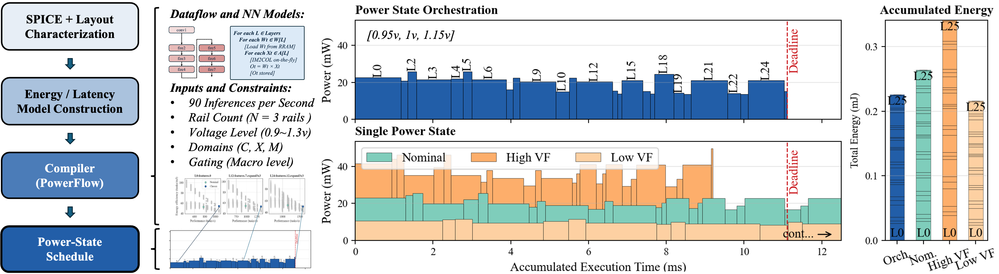
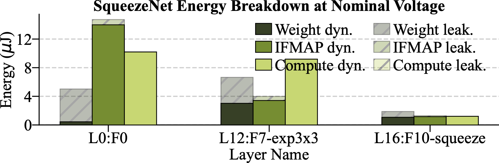
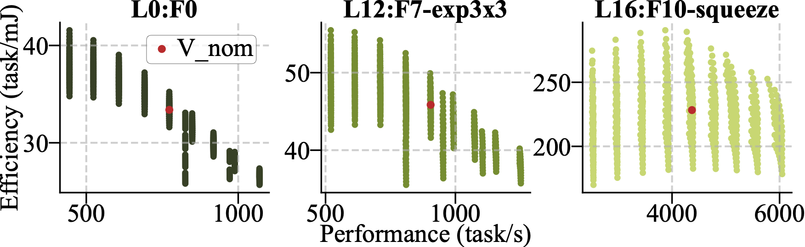

# PowerFlow-DNN ISLPED 2026 Paper Artifact
- Title: PowerFlow-DNN: Compiler-Directed Fine-Grained Power Orchestration for End-to-End Edge AI Inference
- Authors: Paul Yi-Chia Chen, Jeongeun Kim, Wenbo Zhu, Yuanhan Li, Shunyao Huang, Chenjie Weng, and Christopher Torng
- Contact: chenpaul@usc.edu

<!--  -->
<div align="center">
  
</div>
<p align="center">
  PF-DNN orchestration workflow. The compiler analyzes dataflow and constraints to derive candidate power states per layer (left), then jointly schedules them across layers to meet the inference deadline while minimizing energy (right). Please see the paper for more detailed information.
</p>

This repository contains the analytical modeling, voltage-sweep generation,
compiler scheduling, evaluation, and plotting code used to reproduce the
PF-DNN paper results.

This artifact is intended for obtaining the reported analytical results,
compiler schedules, CSV summaries, and figures. To abide by commercial NDAs, it is not the 
hardware deployment toolchain and does not generate the final configuration 
bitstream or configuration image stored onto the hardware.

## Setup

1) Clone repository:
```
git clone https://github.com/usc-acorn/chen-powerflowdnn-islped2026.git
cd chen-powerflowdnn-islped2026
```

2) Use Python 3.9 or newer. From this directory:

```bash
python3 -m venv .venv
source .venv/bin/activate
pip install -r requirements.txt
```

The ILP baseline uses PuLP. If PuLP cannot find a solver on your system, install
or configure a compatible MILP solver before running the ILP/run time experiment.

## Directory Layout

- `model/`: Analytical energy, latency, leakage, and DVFS models.
- `networks/`: layer descriptions for SqueezeNet, ResNet-18, MobileNetV3-Small,
  and MobileViT-XXS.
- `compilers/`: VDD JSON generation and voltage scheduling compilers.
- `figures/`: plotting scripts and the DP-vs-ILP evaluation script.
- `scripts/`: convenience scripts for regenerating sweeps, compiler results,
  run time comparisons, and figures.
- `data/`: generated JSON and CSV data. This directory is gitignored.
- `outputs/`: generated figures. This directory is gitignored.

## Quick test
This should print the energy breakdown and performance for 2 small CNN layers, then generate figure1.pdf and figure2.pdf in the outputs/ folder with expected runtime < 1 minute.


```bash
make test
```

Expected output:
```text
Quick test for model...
=== Layer 1 ===
cycles_layer: 61165440
E_total: 2.012664e-03 J
...

=== Layer 2 ===
cycles_layer: 6156
E_total: 3.759983e-07 J
...

Quick test for model done!
Quick test for figure 1 and 2...
Saved plot: outputs/figure1.pdf
Saved plot: outputs/figure2.pdf
Quick test for figure 1 and 2 done!
```

<table align="center">
  <tr>
    <td align="center">
      <br>
    </td>
    <td align="center">
      <br>
    </td>
  </tr>
</table>
<p align="center">Expected output for figure1 (left) and figure2 (right)</p>


## Reproducing Results

Due to NDA restrictions on proprietary characterization data, the artifact uses representative energy and voltage-frequency models rather than the internal characterization data used in the original study. As a result, absolute numerical values may differ slightly from those reported in the paper. However, the artifact preserves the same optimization workflow, qualitative trends, and conclusions.
The normal flow is:

```bash
make all
```

`make all` regenerates the main VDD sweeps, compiler CSVs, and figures. It
skips the ILP oracle/run time experiment because that experiment can take much
longer, depending on the machine and MILP solver.

This may take 90~120 minutes on a personal laptop.

This runs:

```bash
./scripts/run_all_vdd_combinations.sh  # generate per-layer voltage-state energy and energy estimates 
./scripts/run_all_results.sh           # run the solver sweeps 
./scripts/run_all_figures.sh           # generate all the figures except figure 9 run time evaluation
```

To include the longer ILP/run time experiment:


```bash
make runtime          # only the DP-vs-ILP run time/oracle experiment
make full             # make all, then make runtime
```

`make runtime` may take more than 60 minutes on a personal laptop, and the results may vary when executed on different devices.

`make clean` removes generated files under `data/` and `outputs/`.

## Notes

- The compiler operates on analytical per-layer voltage-state JSON files.
- The DP compiler is intended as a tractable scheduling heuristic; the ILP is
  used as an oracle baseline for reduced space cases.
- Generated `data/` and `outputs/` files are ignored by git and can be
  regenerated with the scripts above.
- While the paper presents a more detailed formulation of the problem and overhead
  look-up tables, we simplify several aspects here to make the solver tractable
  and easier to study. 
